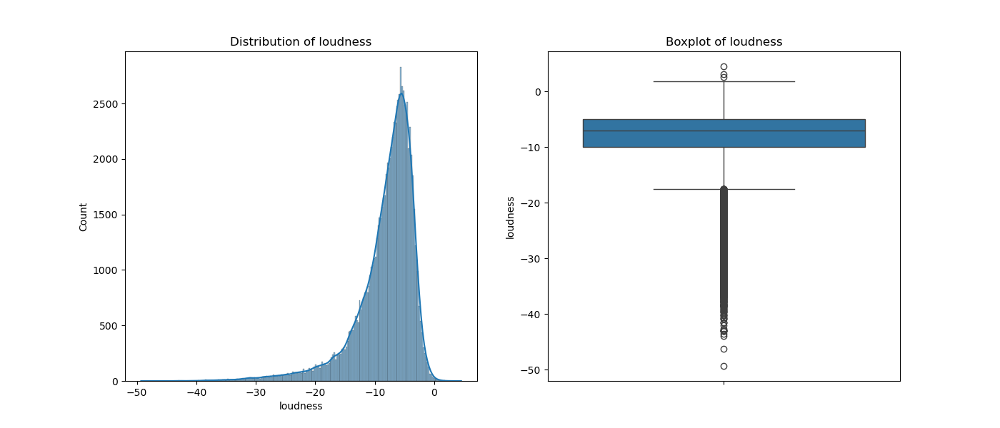
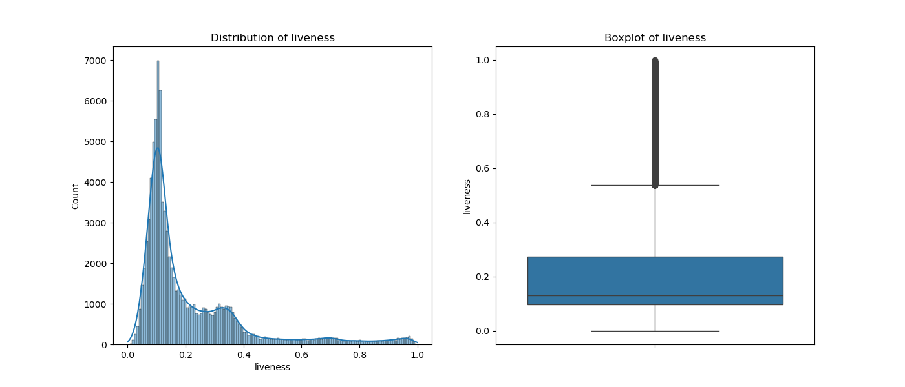

# KNN Classifier

### Euclidean Distance
$$ \text{dist}(x, y) = \sqrt{(x - y)^T (x - y)} $$
Where:
- \( x \) and \( y \) are feature vectors.
- \( T \) denotes the transpose operation.

### Manhattan Distance
$$ \text{dist}(x, y) = \sum_i |x_i - y_i| $$
Where:
- \( x_i \) and \( y_i \) are the \( i \)-th features of vectors \( x \) and \( y \), respectively.

### Cosine Similarity
$$ \text{sim}(x, y) = \frac{x \cdot y}{\|x\| \|y\|} $$
Where:
- \( x \cdot y \) is the dot product of vectors \( x \) and \( y \).
- \( \|x\| \) and \( \|y\| \) are the magnitudes (norms) of vectors \( x \) and \( y \), respectively.

**Cosine Distance**
$$ \text{dist}(x, y) = 1 - \text{sim}(x, y) $$

## Metrics Class
### Accuracy
$$ \text{accuracy} = \frac{\text{Number of Correct Predictions}}{\text{Total Number of Predictions}} $$

### Precision
$$ \text{precision} = \frac{\text{True Positives}}{\text{True Positives} + \text{False Positives}} $$

### Recall
$$ \text{recall} = \frac{\text{True Positives}}{\text{True Positives} + \text{False Negatives}} $$

### F1 Score
$$ \text{F1 Score} = \frac{2 \times \text{precision} \times \text{recall}}{\text{precision} + \text{recall}} $$

## 2.5
Time comparision for inbuilt and my knn model: inbuilt model 3sec maybe it implements some condensation algorithms

my model takes 1min 48sec to run the spotify.csv dataset which is not bad considered its vectorized and the first draft didn't stop running to me test time itself.

# Linear Regression with Polynomial Features, Regularization  
======================================================  
  
This implementation of Linear Regression in Python supports polynomial features, regularization (L1 and L2), and includes an early stopping mechanism based on the convergence of the loss function.  
  
## Key Features  
--------------  
  
### Polynomial Regression  
  
The model can fit polynomial features of any degree by setting the `degree` parameter.  
  
### Regularization  
  
Supports L1 (Lasso) and L2 (Ridge) regularization to prevent overfitting by penalizing large weights.  
  
### Early Stopping  
  
Stops the training process when the change in the loss function between iterations is below a specified threshold (`tolerance`).  
  
## Mathematical Formulation  
-------------------------  
  
### Mean Squared Error (MSE)  
  
The loss function used is the Mean Squared Error (MSE):  
  
$$  
\text{MSE}(\mathbf{w}) = \frac{1}{n} \sum_{i=1}^{n} (y_i - \hat{y}_i)^2  
$$  
  
Where:  
  
* $y_i$ is the actual value.  
* $\hat{y}_i = \mathbf{x}_i^\top \mathbf{w}$ is the predicted value.  
* $\mathbf{w}$ is the vector of model weights.  
  
### Gradient of the Loss Function  
  
The gradient of the MSE with respect to the weights $\mathbf{w}$ is:  
  
$$  
\frac{\partial \text{MSE}}{\partial \mathbf{w}} = -\frac{2}{n} \mathbf{X}^\top (\mathbf{y} - \hat{\mathbf{y}})  
$$  
  
Where:  
  
* $\mathbf{X}$ is the feature matrix.  
* $\mathbf{y}$ is the vector of true values.  
* $\hat{\mathbf{y}}$ is the vector of predicted values.  
  
### Regularization Terms  
  
#### L1 Regularization (Lasso)  
  
Adds a penalty proportional to the absolute value of the weights:  
  
$$  
\text{gradient}_j += \lambda \cdot \text{sign}(w_j)  
$$  
  
#### L2 Regularization (Ridge)  
  
Adds a penalty proportional to the square of the weights:  
  
$$  
\text{gradient}_j += 2\lambda w_j  
$$  
  
### Gradient Descent Update Rule  
  
The weights are updated using the gradient descent rule:  
  
$$  
\mathbf{w} \leftarrow \mathbf{w} - \eta \cdot \text{gradient}  
$$  
  
Where $\eta$ is the learning rate.  
  
## Early Stopping  
--------------  
  
The training process halts when the change in the loss function $\Delta \text{MSE}$ between iterations is less than the specified tolerance:  
  
$$  
|\text{MSE}_{\text{prev}} - \text{MSE}_{\text{current}}| < \text{tolerance}  
$$  

## Plots and Observations for KNN

Box pltos give us 

Based on the these graphs:

1. **Histograms & Boxplots:**
   - **Preprocessing Steps:** Normalize or standardize features

2. **Correlation Heatmaps:**
   - **Preprocessing Steps:** Remove or combine highly correlated features to reduce redundancy and simplify the model. Ensure encoded features don't introduce unexpected correlations.
  
## Plots and Observations for Polynomial Regression and Regulaization

In this dataset the best value of degree is oscillates between 15 17 19 20 mode being 19.
This is because the dataset is pretty small and as training data varies the output might deviate.

Overfitting isnt really very visible because the data appears to fit a very smooth curvebut peak is at deg 5 itself

Plotted the different combinations of hyperparameter results

Ideally when overfitting happens L1 and L2 do help in reducing by introducing a bias as they help in ensuring exploration of data rather than direct exploitation.

So this bias is the parameter in gradient descent step which is added to the cost. so minizing cost will require reduction of both the present gradient + the bias parameter.

