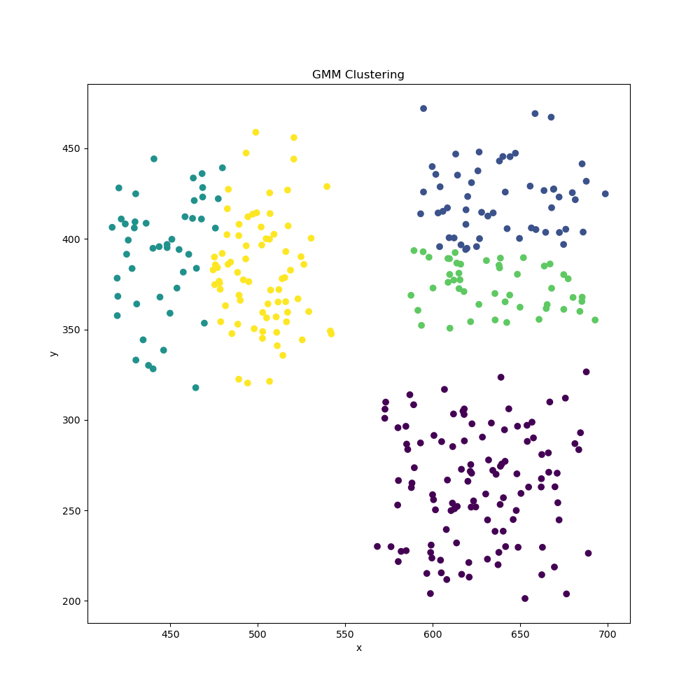

# 3. Kmeans Classifier

Elbow point can be determined from the graph when there is a sudden drop in the slope of the within cluster sum of squares plot and the curve's slope tends to saturate after this point

The formula for WCSS is:

$$
\text{WCSS} = \sum_{i=1}^{K} \sum_{x \in C_i} \| x - \mu_i \|^2
$$

**WCSS :** A lower WCSS indicates that the clusters are more compact and well-separated.

We can see from the plot that kmeans1 is 5, but also fluctuates between 5 and 8 for multiple iterations as the data is high dimentional with only 200 points, one could argue that the data is almost collinear as the number of dimensions increases data tends to get high correlated(as seen in kernel regression).

# 4. GMM clustering

$$
\log L = \sum_{i=1}^{n} \log \left( \sum_{k=1}^{K} \pi_k \mathcal{N}(\mathbf{x}_i \mid \boldsymbol{\mu}_k, \mathbf{\Sigma}_k) \right)
$$

Updating the Means:
$$
\boldsymbol{\mu}_k = \frac{\sum_{i=1}^{n} \gamma_{ik} \mathbf{x}_i}{\sum_{i=1}^{n} \gamma_{ik}}
$$

Updating the Covariances:
$$
\mathbf{\Sigma}_k = \frac{\sum_{i=1}^{n} \gamma_{ik} (\mathbf{x}_i - \boldsymbol{\mu}_k)(\mathbf{x}_i - \boldsymbol{\mu}_k)^T}{\sum_{i=1}^{n} \gamma_{ik}}
$$

Updating the Mixing Coefficients:
$$
\pi_k = \frac{1}{n} \sum_{i=1}^{n} \gamma_{ik}
$$

### Determine the Optimal Number of Clusters for 512 dimensions

- **AIC (Akaike Information Criterion)**:
  $$
  \text{AIC} = 2k - 2 \log L
  $$
 
- **BIC (Bayesian Information Criterion)**:
  $$
  \text{BIC} = k \log(n) - 2 \log L
  $$

#### Computing k (number of parameters)
- **Mean Parameters**: 
  $$
  \text{mean\_parameters} = \text{num\_datapoints} \times \text{num\_clusters}
  $$

- **Mixing Coefficient Parameters**: 
  $$
  \text{mixing\_coefficient\_parameters} = \text{num\_clusters} - 1
  $$

- **Covariance Parameters**:
  $$
  \text{covariance\_parameters} = \frac{\text{num\_datapoints} \times (\text{num\_features} \times (\text{num\_features} + 1))}{2}
  $$

k can be found as:
$$
k = \text{mean\_parameters} + \text{mixing\_coefficient\_parameters} + \text{covariance\_parameters}
$$

### Inbuilt class vs custom class details on the given dataset

1. **Explanation of Issues with Custom GMM Implementation**

**Determinant of Covariance matrix**: In high dimensions, the covariance matrix may become **nearly singular, causing its determinant to approach zero**. This results in numerical instability. I attempted to **regularize** it by adding $\lambda = 1e-6$  ,but the determinant is still too small and the eigen values of the matrix are approximately 0 infact i think python takes it as 0 hence giving inf values for log of 0. I have also tried multiple initializations, for mean kmeans++ and variance as cov of the matrix itself or a diagonal matrix or A dot A.T etc.

2. **How sklearn handles this problem**

**Regularization**: adds a small diagonal matrix which i have tried too.
**Cholesky Decomposition**: I have looked up the inbuilt function details it actually does something called choelsky decomposition and then does precision calculation after decomposing.

# 5. Dimensionality Reduction and Visualization

1. **CheckPCA Implementation** includes the following:
   - Checks if all the reduced dimensions are orthogonal as the eigen vectors have to b.
   - Checks if the reconstuction error is less than the threshold value.

2. **What do the new axes represent** PCA reduces the dataset to 2 and 3 dimensions, where the new axes represent the directions of minimum variance.

3. **Eyeballing the data visualization** gives an idea of how many clusters might be optmial, it would be approximately around 3 from the 2d anf 3d representations.

# 6. PCA + Clustering
### Clustering output of k=3 using kmeans on the complete dataset
Cluster 0:

deer, panda, ape, rose, helicopter, cat, needle, eraser, carrot, fishing, bear, spider, shark, grass, giraffe, forest, lizard, brush, mug, feather, spoon, frog, puppet, gym, lake, climb, monkey, passport, rifle, cow, pencil, starfish, plant, microwave, knit, van, cigarette, microphone, baseball, sun, bucket, puppy, feet, boat, pear, basket, fish, saturn, flute, fruit, scissor, grape, door, calendar, mouse, finger, candle, ant, goldfish, bird, clock, oven, calculator, spiderman, bee, tree, beetle, envelope, skate, hammer, toothbrush, screwdriver, snake, fingerprints, teaspoon, length, dustbin, rain, airplane, ambulance, pizza, television, camera, tomato, dragonfly, parachute, butterfly, car, sword, telephone, elephant, pant, rainy, knife, toothpaste, basketball, wheel, bicycle, arrow, toaster, potato, comb, crocodile, shoe, fork, radio, truck, paintbrush

Cluster 1:

table, roof, stairs, bed, sweater, jacket, bench, peacock, laptop, badminton, chair, ladder, igloo, pillow, throne, tent, loudspeaker, lantern, stove, windmill, keyboard, suitcase

Cluster 2:

drive, sing, listen, dive, flame, sit, knock, exit, brick, smile, bullet, bury, download, eat, postcard, hard, bend, fight, call, fly, face, kneel, scream, kiss, selfie, catch, hit, paint, far, dig, cry, notebook, run, clap, pull, sleep, hollow, clean, sad, empty, slide, drink, draw, pray, arrest, email, buy, burn, fire, close, angry, lazy, scary, hang, book, tattoo, earth, tank, enter, key, swim, zip, happy, loud, love, cook, recycle, cut, walk, sunny

**Clustering output of gmm in the ipynb output(too lengthy and clumsy to put it in report)**

# 7. Cluster Analyssi

### 7.1. K- Means Cluster Analysis

#### CASE 1 :  $k_{\text{kmeans1}} = 6$

Cluster 0:
smile, face, kiss, selfie, cigarette, grape, finger, fingerprints, rain, rainy

Cluster 1:
drive, dive, sit, exit, bullet, postcard, bend, fly, climb, kneel, scream, catch, dig, run, pull, hollow, puppy, empty, fish, slide, bird, skate, snake, earth, key, swim, zip, walk, sunny

Cluster 2:
sing, listen, flame, knock, bury, download, eat, hard, fight, call, hit, paint, far, cry, clap, sleep, clean, sad, drink, draw, pray, arrest, email, buy, burn, fire, close, angry, lazy, scary, hang, book, enter, happy, loud, love, cook, recycle, cut

Cluster 3:
rose, helicopter, table, brick, fishing, grass, forest, mug, gym, lake, passport, roof, stairs, rifle, bed, plant, microwave, notebook, van, microphone, baseball, jacket, bench, bucket, feet, boat, basket, fruit, laptop, door, calendar, chair, mouse, ladder, candle, igloo, clock, oven, calculator, pillow, tree, envelope, tattoo, dustbin, tank, airplane, ambulance, pizza, television, throne, tent, camera, car, loudspeaker, telephone, pant, stove, basketball, wheel, bicycle, toaster, potato, shoe, keyboard, radio, truck, suitcase

Cluster 4:
deer, panda, ape, cat, bear, spider, shark, giraffe, lizard, frog, monkey, cow, starfish, sun, peacock, ant, goldfish, spiderman, bee, beetle, tomato, dragonfly, butterfly, lantern, elephant, crocodile

Cluster 5:
needle, eraser, carrot, brush, feather, spoon, puppet, pencil, knit, sweater, pear, saturn, flute, scissor, badminton, hammer, toothbrush, screwdriver, teaspoon, length, parachute, sword, knife, toothpaste, windmill, arrow, comb, fork, paintbrush

#### CASE 2 :  $k_{\text{kmeans3}} = 7$
Cluster 0:
panda, ape, cat, eat, rifle, cow, pencil, dig, run, sun, ant, bee, tomato, pant, potato

Cluster 1:
sit, mug, gym, bed, van, feet, laptop, calendar, calculator, television, camera, car, radio

Cluster 2:
drive, sing, rose, dive, knock, exit, brick, smile, bullet, bury, postcard, bend, fly, face, climb, kneel, scream, kiss, selfie, catch, paint, plant, clap, pull, baseball, hollow, puppy, empty, fish, slide, drink, arrest, angry, book, tattoo, earth, rain, tank, pizza, key, swim, zip, cook, arrow, recycle, shoe, walk, sunny, truck

Cluster 3:
table, passport, roof, stairs, microwave, notebook, sweater, microphone, jacket, bench, bucket, boat, basket, door, badminton, chair, ladder, igloo, clock, oven, pillow, envelope, skate, dustbin, ambulance, throne, tent, loudspeaker, lantern, telephone, stove, basketball, wheel, bicycle, toaster, keyboard, suitcase

Cluster 4:
deer, helicopter, fishing, bear, spider, shark, grass, giraffe, forest, lizard, frog, lake, monkey, starfish, pear, peacock, saturn, fruit, grape, mouse, goldfish, bird, spiderman, tree, beetle, snake, airplane, dragonfly, parachute, butterfly, elephant, rainy, windmill, crocodile

Cluster 5:
listen, flame, download, hard, fight, call, hit, far, cry, sleep, clean, sad, draw, pray, email, buy, burn, fire, close, lazy, scary, hang, enter, happy, loud, love, cut

Cluster 6:
needle, eraser, carrot, brush, feather, spoon, puppet, knit, cigarette, flute, scissor, finger, candle, hammer, toothbrush, screwdriver, fingerprints, teaspoon, length, sword, knife, toothpaste, comb, fork, paintbrush

---
#### CASE 3 :  $k_{\text{2}} = 3$
Cluster 0:
panda, ape, cat, eraser, table, mug, gym, roof, stairs, rifle, cow, pencil, bed, starfish, plant, microwave, van, sweater, microphone, jacket, bench, sun, bucket, feet, pear, peacock, fruit, grape, laptop, door, calendar, chair, ladder, ant, igloo, oven, calculator, bee, pillow, tree, envelope, ambulance, television, throne, tent, camera, tomato, car, loudspeaker, lantern, elephant, pant, stove, wheel, windmill, toaster, potato, keyboard, suitcase

Cluster 1:
drive, sing, listen, dive, flame, sit, knock, exit, brick, smile, bullet, bury, download, eat, postcard, hard, bend, fight, call, fly, face, climb, kneel, scream, kiss, passport, selfie, catch, hit, paint, far, dig, cry, notebook, run, clap, pull, sleep, hollow, puppy, clean, basket, sad, empty, slide, drink, draw, pray, arrest, email, buy, clock, burn, fire, close, angry, lazy, scary, hang, hammer, book, tattoo, earth, dustbin, tank, enter, key, swim, zip, happy, loud, love, cook, basketball, recycle, cut, shoe, walk, sunny, radio, truck

Cluster 2:
deer, rose, helicopter, needle, carrot, fishing, bear, spider, shark, grass, giraffe, forest, lizard, brush, feather, spoon, frog, puppet, lake, monkey, knit, cigarette, baseball, boat, fish, saturn, flute, scissor, badminton, mouse, finger, candle, goldfish, bird, spiderman, beetle, skate, toothbrush, screwdriver, snake, fingerprints, teaspoon, length, rain, airplane, pizza, dragonfly, parachute, butterfly, sword, telephone, rainy, knife, toothpaste, bicycle, arrow, comb, crocodile, fork, paintbrush

### Best among the three : 
Based on the semantic coherence of the clusters, I would say that the clustering with k = 6 (Case 1) appears to be the best among the three

1. k = 6 (Case 1):
The clusters show clear thematic groupings:
- Cluster 0: Facial features and expressions
- Cluster 1: Action verbs and nature-related words
- Cluster 2: More abstract actions and emotions
- Cluster 3: Household items and vehicles
- Cluster 4: Animals and insects
- Cluster 5: Tools and small objects

2. k = 7 (Case 2):
there's more mixing of concepts across clusters compared to k = 6.

3. k = 3 (Case 3):
The clusters are too broad and mix many different concepts.

The 6-cluster woild be the better one so **$k_{\text{kmeans}} = 6$**.

### 7.2.  GMM Cluster Analysis

In this part , I compared the clustering results obtained using $k_{\text{gmm1}} = 1$ , $k_{\text{gmm3}} = 3$, $k_{\text{2}} = 3$.and evaluate which approach yields the most coherent and interpretable clusters .

---
#### CASE 1 :  $k_{\text{gmm1}} = 1$ 

It contains everything so ideally it doesnt really give any semantic meaning unless all the words actually are similar which is not the case for this dataset.
 
---
#### CASE 2 :  $k_{\text{gmm3}} = k_2 = 3$

Cluster 0:
drive, sing, listen, rose, dive, flame, helicopter, knock, needle, eraser, carrot, exit, brick, fishing, bullet, grass, bury, download, forest, brush, feather, hard, spoon, bend, fight, puppet, call, lake, climb, kneel, scream, kiss, catch, hit, paint, plant, far, cry, sleep, knit, cigarette, hollow, clean, pear, empty, saturn, slide, flute, drink, scissor, draw, mouse, pray, arrest, finger, candle, goldfish, burn, fire, close, angry, lazy, scary, tree, hang, hammer, toothbrush, screwdriver, earth, fingerprints, teaspoon, length, rain, tank, airplane, pizza, enter, key, swim, zip, parachute, sword, happy, loud, love, rainy, knife, cook, toothpaste, bicycle, windmill, arrow, recycle, comb, walk, fork, sunny, paintbrush

Cluster 1:
sit, table, smile, mug, eat, postcard, gym, face, passport, selfie, roof, stairs, rifle, pencil, bed, microwave, dig, notebook, run, clap, pull, van, sweater, microphone, baseball, jacket, bench, sun, bucket, feet, boat, basket, sad, fruit, laptop, door, calendar, badminton, chair, ladder, email, buy, igloo, clock, oven, calculator, pillow, envelope, skate, book, tattoo, dustbin, ambulance, television, throne, tent, camera, tomato, car, loudspeaker, lantern, telephone, pant, stove, basketball, wheel, toaster, potato, cut, shoe, keyboard, radio, truck, suitcase

Cluster 2:
deer, panda, ape, cat, bear, spider, shark, giraffe, lizard, frog, fly, monkey, cow, starfish, puppy, peacock, fish, grape, ant, bird, spiderman, bee, beetle, snake, dragonfly, butterfly, elephant, crocodile

#### Best among the three : 

$k_{\text{2}} = 3$ 

Therefore , **$k_{\text{gmm}} = 3$**

## Better Clustering : k_means vs gmm 

**K-Means vs GMM: Comparing Clustering Methods**

K-Means demonstrates superior performance in grouping target words:

1. **Improved Intra-Cluster Similarity**
   K-Means excels at grouping related items. For example, Cluster 2 effectively combines sports, activities, and animals into a cohesive group.

2. **Clear Cluster Boundaries**
   K-Means maintains distinct separation between clusters, reducing overlap and creating well-defined categories.

3. **Intuitive**
   K-Means clusters are easier to understand at a glance.

In contrast, GMM has muc more mixed themes and less distinct boundaries. Its groupings tend to be less intuitive and harder to interpret.

Kmeans is better than GMM in this clustering objective.

## 8 Hierarchical Clustering

Hierarchical clustering is a technique for grouping objects into clusters based on their similarity, resulting in a **hierarchical tree structure known as a dendrogram.** This approach helps visualize the arrangement of clusters and their relationships.

### Part 1: Exploring Distance Metrics and Linkage Methods

In hierarchical clustering, various distance metrics and linkage methods can be used to calculate the distances between clusters. In this analysis, I explored several combinations to identify the best-performing method:

### Distance Metrics

1. **Euclidean Distance**
   - **Formula**: 
     $
     d(x, y) = \sqrt{\sum_{i=1}^n (x_i - y_i)^2}
     $
   - **Description**: Measures the straight-line distance between two points in Euclidean space.

2. **Cosine Distance**
   - **Formula**: 
     $
     d(x, y) = 1 - \frac{\sum_{i=1}^n x_i y_i}{\sqrt{\sum_{i=1}^n x_i^2} \sqrt{\sum_{i=1}^n y_i^2}}
     $
   - **Description**: Measures the cosine of the angle between two vectors, emphasizing the orientation rather than magnitude.

3. **Cityblock Distance (Manhattan Distance)**
   - **Formula**: 
     $
     d(x, y) = \sum_{i=1}^n |x_i - y_i|
     $
   - **Description**: Measures the distance between two points by summing the absolute differences of their coordinates.

**Linkage Methods:**
- **Single Linkage**
  - **Formula**: 
    $
    d(C_i, C_j) = \min_{x \in C_i, y \in C_j} d(x, y)
    $
  - **Description**: Distance between two clusters is defined as the minimum distance between points in the two clusters.

- **Complete Linkage**
  - **Formula**: 
    $
    d(C_i, C_j) = \max_{x \in C_i, y \in C_j} d(x, y)
    $
  - **Description**: Distance between two clusters is defined as the maximum distance between points in the two clusters.

- **Average Linkage**
  - **Formula**: 
    $
    d(C_i, C_j) = \frac{1}{|C_i||C_j|} \sum_{x \in C_i} \sum_{y \in C_j} d(x, y)
    $
  - **Description**: Distance between two clusters is defined as the average distance between all pairs of points in the two clusters.

- **Ward’s Linkage**
  - **Formula**: 
    $
    d(C_i, C_j) = \frac{|C_i| |C_j|}{|C_i| + |C_j|} \| \bar{x}_i - \bar{x}_j \|^2
    $
  - **Description**: Distance between two clusters is defined as the increase in total within-cluster variance when two clusters are merged. It minimizes the variance within clusters.

**Dendrograms for Each Linkage Method and Distance Metric Combination:**

<!--  -->

From the dendrograms, it is evident that the Ward linkage method provides the most coherent and distinct clusters

### Clustering Results
ward comes out to be the best metric
kbest1 = 6  
kbest2 = 3 

With kbest = 6
Cluster 1:
sing, listen, dive, flame, knock, exit, brick, smile, bury, download, hard, bend, fight, face, scream, kiss, selfie, catch, hit, paint, far, cry, sleep, hollow, clean, sad, empty, slide, drink, door, draw, pray, arrest, buy, burn, fire, close, angry, lazy, scary, hang, tattoo, earth, enter, key, swim, happy, loud, love, cook, cut

Cluster 2:
deer, spider, shark, giraffe, lizard, feather, frog, fly, starfish, peacock, fish, ant, goldfish, bird, spiderman, bee, beetle, snake, dragonfly, butterfly, crocodile

Cluster 3:
panda, ape, sit, cat, eraser, carrot, bear, grass, forest, eat, puppet, gym, kneel, monkey, cow, pencil, plant, dig, run, clap, pull, sun, puppy, feet, pear, fruit, grape, finger, tree, fingerprints, rain, zip, tomato, elephant, pant, rainy, potato, shoe, sunny

Cluster 4:
brush, spoon, scissor, hammer, toothbrush, screwdriver, teaspoon, length, sword, knife, toothpaste, comb, fork, paintbrush

Cluster 5:
postcard, call, passport, microwave, notebook, microphone, laptop, calendar, email, oven, calculator, envelope, book, dustbin, television, camera, loudspeaker, telephone, stove, recycle, toaster, keyboard, radio, suitcase

Cluster 6:
drive, rose, helicopter, needle, table, fishing, bullet, mug, lake, climb, roof, stairs, rifle, bed, knit, van, sweater, cigarette, baseball, jacket, bench, bucket, boat, basket, saturn, flute, badminton, chair, mouse, ladder, candle, igloo, clock, pillow, skate, tank, airplane, ambulance, pizza, throne, tent, parachute, car, lantern, basketball, wheel, bicycle, windmill, arrow, walk, truck

With kbest2 = 3

Cluster 1:
sing, listen, dive, flame, knock, exit, brick, smile, bury, download, hard, bend, fight, face, scream, kiss, selfie, catch, hit, paint, far, cry, sleep, hollow, clean, sad, empty, slide, drink, door, draw, pray, arrest, buy, burn, fire, close, angry, lazy, scary, hang, tattoo, earth, enter, key, swim, happy, loud, love, cook, cut

Cluster 2:
deer, panda, ape, sit, cat, eraser, carrot, bear, spider, shark, grass, giraffe, forest, lizard, feather, eat, frog, puppet, fly, gym, kneel, monkey, cow, pencil, starfish, plant, dig, run, clap, pull, sun, puppy, feet, pear, peacock, fish, fruit, grape, finger, ant, goldfish, bird, spiderman, bee, tree, beetle, snake, fingerprints, rain, zip, tomato, dragonfly, butterfly, elephant, pant, rainy, potato, crocodile, shoe, sunny

Cluster 3:
drive, rose, helicopter, needle, table, fishing, bullet, brush, mug, postcard, spoon, call, lake, climb, passport, roof, stairs, rifle, bed, microwave, notebook, knit, van, sweater, cigarette, microphone, baseball, jacket, bench, bucket, boat, basket, saturn, flute, scissor, laptop, calendar, badminton, chair, mouse, ladder, email, candle, igloo, clock, oven, calculator, pillow, envelope, skate, hammer, toothbrush, book, screwdriver, teaspoon, length, dustbin, tank, airplane, ambulance, pizza, television, throne, tent, camera, parachute, car, sword, loudspeaker, lantern, telephone, stove, knife, toothpaste, basketball, wheel, bicycle, windmill, arrow, recycle, toaster, comb, walk, keyboard, fork, radio, truck, suitcase, paintbrush

### Conclusion
Comparing Hierarcial and Kmeans, Hierarcial has slighty better semantic meaning than the kmeans clusters and same with the comparision with 

## 9 Nearest Neighbor Search

### 9.1. PCA + KNN

dimensions are reduced from 18 to 9 based on the scree plot for retaining 75% of the variance 

---

#### Fit KNN on this reduced dataset 

**Best k**: 23
**Best Distance Metric**: Manhattan

**Comparing the Metrics and Time**  

### Observations

**Complete Dataset:** Model takes `139`s.
**Reduced Dataset:** Model takes `112`s.

**Complete Dataset:** The KNN model has an accuracy of `0.2510`
**Reduced Dataset:** The KNN model has an accuracy of `0.1868`

Although PCA sped up the KNN model, the trade-off in accuracy indicates that some important information was lost in the reduction process. The complete dataset, despite taking longer to compute, yielded better accuracy. A balance between efficiency and performance may require experimenting with different PCA thresholds or advanced feature selection techniques.

---