# Assignment - 3 MultiLayer Perceptron and AutoEncoders

## 2. Multi Layer Perceptron 
## Dataset Analysis and Preprocessing
#### 2.1.1

<div>
<style scoped>
    .dataframe tbody tr th:only-of-type {
        vertical-align: middle;
    }

    .dataframe tbody tr th {
        vertical-align: top;
    }

    .dataframe thead th {
        text-align: right;
    }
</style>
<table border="1" class="dataframe">
  <thead>
    <tr style="text-align: right;">
      <th></th>
      <th>fixed acidity</th>
      <th>volatile acidity</th>
      <th>citric acid</th>
      <th>residual sugar</th>
      <th>chlorides</th>
      <th>free sulfur dioxide</th>
      <th>total sulfur dioxide</th>
      <th>density</th>
      <th>pH</th>
      <th>sulphates</th>
      <th>alcohol</th>
      <th>quality</th>
      <th>Id</th>
    </tr>
  </thead>
  <tbody>
    <tr>
      <th>count</th>
      <td>1143.000000</td>
      <td>1143.000000</td>
      <td>1143.000000</td>
      <td>1143.000000</td>
      <td>1143.000000</td>
      <td>1143.000000</td>
      <td>1143.000000</td>
      <td>1143.000000</td>
      <td>1143.000000</td>
      <td>1143.000000</td>
      <td>1143.000000</td>
      <td>1143.000000</td>
      <td>1143.000000</td>
    </tr>
    <tr>
      <th>mean</th>
      <td>8.311111</td>
      <td>0.531339</td>
      <td>0.268364</td>
      <td>2.532152</td>
      <td>0.086933</td>
      <td>15.615486</td>
      <td>45.914698</td>
      <td>0.996730</td>
      <td>3.311015</td>
      <td>0.657708</td>
      <td>10.442111</td>
      <td>5.657043</td>
      <td>804.969379</td>
    </tr>
    <tr>
      <th>std</th>
      <td>1.747595</td>
      <td>0.179633</td>
      <td>0.196686</td>
      <td>1.355917</td>
      <td>0.047267</td>
      <td>10.250486</td>
      <td>32.782130</td>
      <td>0.001925</td>
      <td>0.156664</td>
      <td>0.170399</td>
      <td>1.082196</td>
      <td>0.805824</td>
      <td>463.997116</td>
    </tr>
    <tr>
      <th>min</th>
      <td>4.600000</td>
      <td>0.120000</td>
      <td>0.000000</td>
      <td>0.900000</td>
      <td>0.012000</td>
      <td>1.000000</td>
      <td>6.000000</td>
      <td>0.990070</td>
      <td>2.740000</td>
      <td>0.330000</td>
      <td>8.400000</td>
      <td>3.000000</td>
      <td>0.000000</td>
    </tr>
    <tr>
      <th>25%</th>
      <td>7.100000</td>
      <td>0.392500</td>
      <td>0.090000</td>
      <td>1.900000</td>
      <td>0.070000</td>
      <td>7.000000</td>
      <td>21.000000</td>
      <td>0.995570</td>
      <td>3.205000</td>
      <td>0.550000</td>
      <td>9.500000</td>
      <td>5.000000</td>
      <td>411.000000</td>
    </tr>
    <tr>
      <th>50%</th>
      <td>7.900000</td>
      <td>0.520000</td>
      <td>0.250000</td>
      <td>2.200000</td>
      <td>0.079000</td>
      <td>13.000000</td>
      <td>37.000000</td>
      <td>0.996680</td>
      <td>3.310000</td>
      <td>0.620000</td>
      <td>10.200000</td>
      <td>6.000000</td>
      <td>794.000000</td>
    </tr>
    <tr>
      <th>75%</th>
      <td>9.100000</td>
      <td>0.640000</td>
      <td>0.420000</td>
      <td>2.600000</td>
      <td>0.090000</td>
      <td>21.000000</td>
      <td>61.000000</td>
      <td>0.997845</td>
      <td>3.400000</td>
      <td>0.730000</td>
      <td>11.100000</td>
      <td>6.000000</td>
      <td>1209.500000</td>
    </tr>
    <tr>
      <th>max</th>
      <td>15.900000</td>
      <td>1.580000</td>
      <td>1.000000</td>
      <td>15.500000</td>
      <td>0.611000</td>
      <td>68.000000</td>
      <td>289.000000</td>
      <td>1.003690</td>
      <td>4.010000</td>
      <td>2.000000</td>
      <td>14.900000</td>
      <td>8.000000</td>
      <td>1597.000000</td>
    </tr>
  </tbody>
</table>
</div>

#### 2.1.2
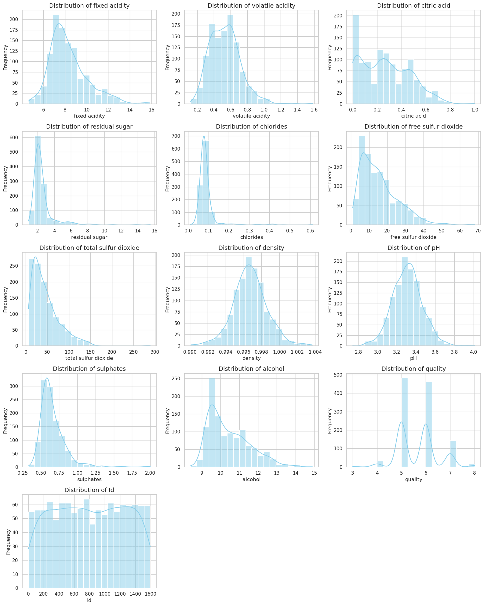

#### 2.1.3
Used Label Encoder and Standard Scaler for the data and also handled missing data by filing the mean.

### 2.2 Model Building From Scratch

**BackProp Details**

Cost Function Derivative for backprop

$$J\left(a^{[3]} \mid y\right)=-y \log \left(a^{[3]}\right)-(1-y) \log \left(1-a^{[3]}\right)$$

BackProp Gradient equations

$$\begin{aligned} \frac{\partial J}{\partial \mathbf{W}^{[3]}} & =\frac{d J}{d a^{[3]}} \frac{d a^{[3]}}{d z^{[3]}} \frac{\partial z^{[3]}}{\partial \mathbf{W}^{[3]}} \\ \frac{\partial J}{\partial b^{[3]}} & =\frac{d J}{d a^{[3]}} \frac{d a^{[3]}}{d z^{[3]}} \frac{\partial z^{[3]}}{\partial b^{[3]}}\end{aligned}$$

Example of a three layered multi layer perceptron neural network.

Third Layer
$$
\begin{gathered}
d \mathbf{W}^{[3]}=\delta^{[3]} a^{[2] T} \\
d b^{[3]}=\delta^{[3]} \\
\delta^{[3]}=a^{[3]}-y
\end{gathered}
$$

Second Layer
$$
\begin{gathered}
d \mathbf{W}^{[2]}=\boldsymbol{\delta}^{[2]} \mathbf{a}^{[1] T} \\
d \mathbf{b}^{[2]}=\boldsymbol{\delta}^{[2]} \\
\boldsymbol{\delta}^{[2]}=\mathbf{W}^{[3] T} \delta^{[3]} * g^{\prime}\left(\mathbf{z}^{[2]}\right)
\end{gathered}
$$

First Layer
$$
\begin{gathered}
d \mathbf{W}^{[1]}=\boldsymbol{\delta}^{[1]} \mathbf{x}^T \\
d \mathbf{b}^{[1]}=\boldsymbol{\delta}^{[1]} \\
\boldsymbol{\delta}^{[1]}=\mathbf{W}^{[2] T} \delta^{[2]} * g^{\prime}\left(\mathbf{z}^{[1]}\right)
\end{gathered}
$$

Another important thing to note is that the output is a softmax function becuase we need to output probabilities of and then classify to the one which has the highest probabilities and the sum of all these should be 1 necessitating the use of a softmax function.

An interesting thing to note is that taking the derivative of the loss as both mse and binary cross entropy have given very similar results which is not surprising at the very least.

**Test Run for the following hyperparamters** 
```
mlp = MLP_SingleLabelClassifier(input_size=X_train.shape[1], hidden_layers=[20, 20], output_size=num_classes,
          learning_rate=0.01, activation='tanh', optimizer='mini_batch_gd',
          batch_size=32, epochs=1000)
```

Early stopping at epoch 137. Best validation loss: 1.0665
Training Data Metrics:
  Accuracy: 0.661925601750547

Test Data Metrics:
  Accuracy: 0.631578947368421

Training Data Classification Report:
              precision    recall  f1-score   support

           0       0.00      0.00      0.00         5
           1       1.00      0.03      0.07        29
           2       0.70      0.79      0.74       389
           3       0.63      0.68      0.65       369
           4       0.60      0.42      0.49       110
           5       0.00      0.00      0.00        12

    accuracy                           0.66       914
   macro avg       0.49      0.32      0.33       914
weighted avg       0.66      0.66      0.64       914

Test Data Classification Report:
              precision    recall  f1-score   support

           1       0.00      0.00      0.00         1
           2       0.64      0.67      0.65        48
           3       0.65      0.64      0.65        53
           4       0.50      0.60      0.55        10
           5       0.00      0.00      0.00         2

    accuracy                           0.63       114
   macro avg       0.36      0.38      0.37       114
weighted avg       0.62      0.63      0.62       114

Layer 1:

  Weights - Max difference: 2.718982736443082e-09

  Biases - Max difference: 6.4060025441788765e-09

  Relative difference (weights): 2.1347216950295636e-07

  Relative difference (biases): 4.322618242263979e-07

Layer 2:

  Weights - Max difference: 3.4170251552324143e-09

  Biases - Max difference: 6.113528176320687e-09

  Relative difference (weights): 3.9494417957312275e-07

  Relative difference (biases): 9.40217072841439e-07

Layer 3:

  Weights - Max difference: 7.3655226705098e-09

  Biases - Max difference: 7.586337138782567e-09

  Relative difference (weights): 5.345086151443521e-07

  Relative difference (biases): 1.052437534849658e-06


gradient check gave a very good output of around 10^-7 using the norm verification formula, this was the formula used for calculating the numerical gradient 

$$\frac{d}{d \theta} J(\theta)=\lim _{\epsilon \rightarrow 0} \frac{J(\theta+\epsilon)-J(\theta-\epsilon)}{2 \epsilon}$$

#### 2.3 Wandb Integration

```
sweep_config = {
    'method': 'grid', 
    'metric': {'name': 'final_val_acc', 'goal': 'maximize'},
    'parameters': {
        'hidden_layers': {'values': [[64], [32, 32], [32, 64], [32, 32, 32]]},
        'learning_rate': {'values': [0.001, 0.01]},
        'activation': {'values': ['relu', 'sigmoid', 'linear', 'tanh']},
        'optimizer': {'values': ['sgd', 'mini_batch_gd', 'batch_gd']},
        'batch_size': {'values': [16, 32]},
        'epochs': {'values': [100, 200]}
    }
}
```


#### 2.4 Evaluating Single Label Classification Model

Training Data Metrics:
  Accuracy: 0.7385120350109409

Test Data Metrics:
  Accuracy: 0.631578947368421   

Training Data Classification Report:
              precision    recall  f1-score   support

           0       1.00      0.20      0.33         5
           1       0.00      0.00      0.00        29
           2       0.77      0.82      0.79       389
           3       0.70      0.78      0.74       369
           4       0.80      0.62      0.70       110
           5       0.00      0.00      0.00        12

    accuracy                           0.74       914
   macro avg       0.54      0.40      0.43       914
weighted avg       0.71      0.74      0.72       914

Test Data Classification Report:
              precision    recall  f1-score   support

           1       0.00      0.00      0.00         1
           2       0.65      0.65      0.65        48
           3       0.66      0.66      0.66        53
           4       0.46      0.60      0.52        10
           5       0.00      0.00      0.00         2

    accuracy                           0.63       114
   macro avg       0.35      0.38      0.37       114
weighted avg       0.62      0.63      0.62       114
### 2.6
**Best Parameters**: 
 - Validation Accuracy : 0.683

-  Test Accuracy : 0.691

-  Number of epochs : 1000

 - Learning Rate : 0.001

 - Optimizer : Stochastic Gradient Descent

 - Activation Function : ReLU


#### 2.7
The above table has all 5 wine quality classes and the classification report gives all metrics for all the 5 classes seperately

Most of the labels are between 2 3 and 4 as we can see from the histogram table. The model does well in classifying between 2 3 and 4 but it's perfomance is poor for classifying into the other classes as the data available for those classes is very less.

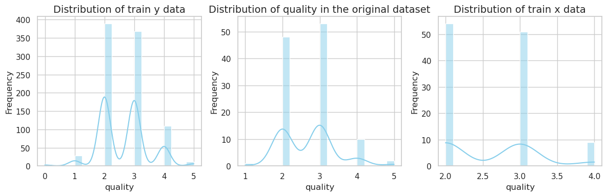

## 3. Multi Layer Perceptron Regression

### 3.1 Data Preprocessing

#### 3.1.1
<div>
<style scoped>
    .dataframe tbody tr th:only-of-type {
        vertical-align: middle;
    }

    .dataframe tbody tr th {
        vertical-align: top;
    }

    .dataframe thead th {
        text-align: right;
    }
</style>
<table border="1" class="dataframe">
  <thead>
    <tr style="text-align: right;">
      <th></th>
      <th>CRIM</th>
      <th>ZN</th>
      <th>INDUS</th>
      <th>CHAS</th>
      <th>NOX</th>
      <th>RM</th>
      <th>AGE</th>
      <th>DIS</th>
      <th>RAD</th>
      <th>TAX</th>
      <th>PTRATIO</th>
      <th>B</th>
      <th>LSTAT</th>
      <th>MEDV</th>
    </tr>
  </thead>
  <tbody>
    <tr>
      <th>count</th>
      <td>486.000000</td>
      <td>486.000000</td>
      <td>486.000000</td>
      <td>486.000000</td>
      <td>506.000000</td>
      <td>506.000000</td>
      <td>486.000000</td>
      <td>506.000000</td>
      <td>506.000000</td>
      <td>506.000000</td>
      <td>506.000000</td>
      <td>506.000000</td>
      <td>486.000000</td>
      <td>506.000000</td>
    </tr>
    <tr>
      <th>mean</th>
      <td>3.611874</td>
      <td>11.211934</td>
      <td>11.083992</td>
      <td>0.069959</td>
      <td>0.554695</td>
      <td>6.284634</td>
      <td>68.518519</td>
      <td>3.795043</td>
      <td>9.549407</td>
      <td>408.237154</td>
      <td>18.455534</td>
      <td>356.674032</td>
      <td>12.715432</td>
      <td>22.532806</td>
    </tr>
    <tr>
      <th>std</th>
      <td>8.720192</td>
      <td>23.388876</td>
      <td>6.835896</td>
      <td>0.255340</td>
      <td>0.115878</td>
      <td>0.702617</td>
      <td>27.999513</td>
      <td>2.105710</td>
      <td>8.707259</td>
      <td>168.537116</td>
      <td>2.164946</td>
      <td>91.294864</td>
      <td>7.155871</td>
      <td>9.197104</td>
    </tr>
    <tr>
      <th>min</th>
      <td>0.006320</td>
      <td>0.000000</td>
      <td>0.460000</td>
      <td>0.000000</td>
      <td>0.385000</td>
      <td>3.561000</td>
      <td>2.900000</td>
      <td>1.129600</td>
      <td>1.000000</td>
      <td>187.000000</td>
      <td>12.600000</td>
      <td>0.320000</td>
      <td>1.730000</td>
      <td>5.000000</td>
    </tr>
    <tr>
      <th>25%</th>
      <td>0.081900</td>
      <td>0.000000</td>
      <td>5.190000</td>
      <td>0.000000</td>
      <td>0.449000</td>
      <td>5.885500</td>
      <td>45.175000</td>
      <td>2.100175</td>
      <td>4.000000</td>
      <td>279.000000</td>
      <td>17.400000</td>
      <td>375.377500</td>
      <td>7.125000</td>
      <td>17.025000</td>
    </tr>
    <tr>
      <th>50%</th>
      <td>0.253715</td>
      <td>0.000000</td>
      <td>9.690000</td>
      <td>0.000000</td>
      <td>0.538000</td>
      <td>6.208500</td>
      <td>76.800000</td>
      <td>3.207450</td>
      <td>5.000000</td>
      <td>330.000000</td>
      <td>19.050000</td>
      <td>391.440000</td>
      <td>11.430000</td>
      <td>21.200000</td>
    </tr>
    <tr>
      <th>75%</th>
      <td>3.560263</td>
      <td>12.500000</td>
      <td>18.100000</td>
      <td>0.000000</td>
      <td>0.624000</td>
      <td>6.623500</td>
      <td>93.975000</td>
      <td>5.188425</td>
      <td>24.000000</td>
      <td>666.000000</td>
      <td>20.200000</td>
      <td>396.225000</td>
      <td>16.955000</td>
      <td>25.000000</td>
    </tr>
    <tr>
      <th>max</th>
      <td>88.976200</td>
      <td>100.000000</td>
      <td>27.740000</td>
      <td>1.000000</td>
      <td>0.871000</td>
      <td>8.780000</td>
      <td>100.000000</td>
      <td>12.126500</td>
      <td>24.000000</td>
      <td>711.000000</td>
      <td>22.000000</td>
      <td>396.900000</td>
      <td>37.970000</td>
      <td>50.000000</td>
    </tr>
  </tbody>
</table>
</div>

#### 3.1.2

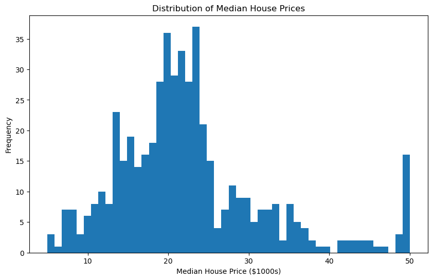
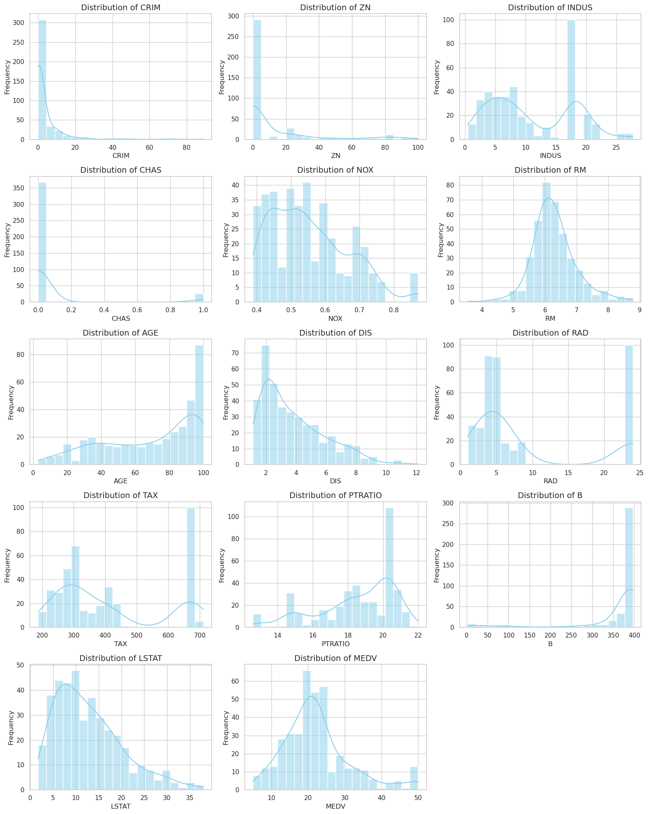

### 3.2 MLP Regression from Scratch

For performing the regresion task the main differences from the single label classification are as follow:

- The Final Activation layer isnt softmax as the output is regression and shouldn't be probabilities, so it is a linear function thus changing one derivative term in the backprop algorithm.
- And the loss function is the Mean Square Error function.

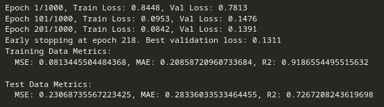

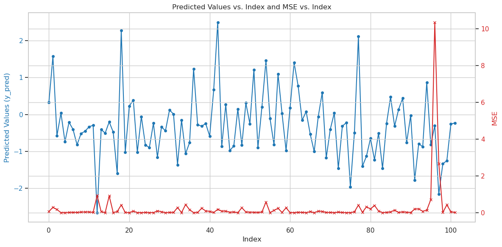

We can see that the comparision of 10 values are close too

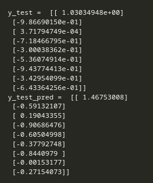

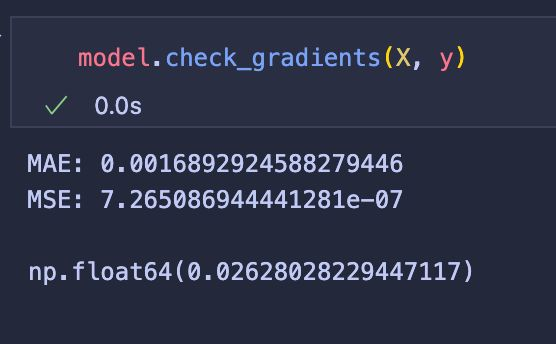

### 3.3 Wandb Integration


We can see the sgd performs much much better compared to that of the other optimizers, sigmoid and relu are better than tanh when others are hyperparamters are fixed, learning rate is optimial at 0.01 and 2 layers > 1layer > 3 layers here .

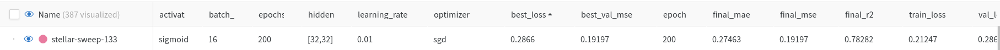

These are the best parameters
### 3.4 
```
mlp = MLP_Regressor(input_size=X_train.shape[1], hidden_layers=[32, 32], output_size=1,
                    learning_rate=0.01, activation='sigmoid', optimizer='sgd',
                    batch_size=32, epochs=200,  patience=10)
```

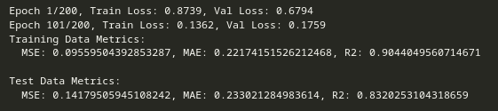

### 3.5 MSE vs BCE


### 3.6 Analysis


There is difference we can see in the rate of convergence the mse convergence is much quicker and decays faster as compared to that of the bce loss which looks more logarithmic than that of the the BCE loss plot.

The mse is high when the data stops following a certain patern 
Also the mse appears shoots up when the peaks are too close together in the sequence of data

### 3.7 Bonus

I have integrated both the MLP Regressor and Classifier into the MLP Class where the onyl changes are argument has a new 'classifer/regressor' based on whcih there are if conditions for the output layer and its activation along with some changes in gradient function under the same if condition.
Also the loss is different for both so even the loss and loss derivative have the if condition.

## 4. AutoEncoders

### 4.1 
For the AutoEncoder we make a multi layer output mlp regressor with the input and output dimensions equal to the dimensions of the present dataset and the central layer is the latent layer which learns the reduced dataset 
In out case it is 15 -> 12 -> 9 -> 12 -> 15 where 9 is latent layer containing reduced data.
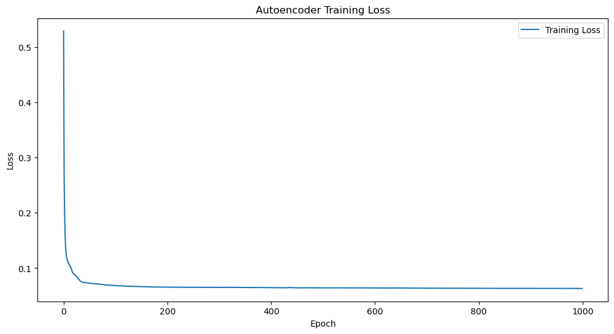
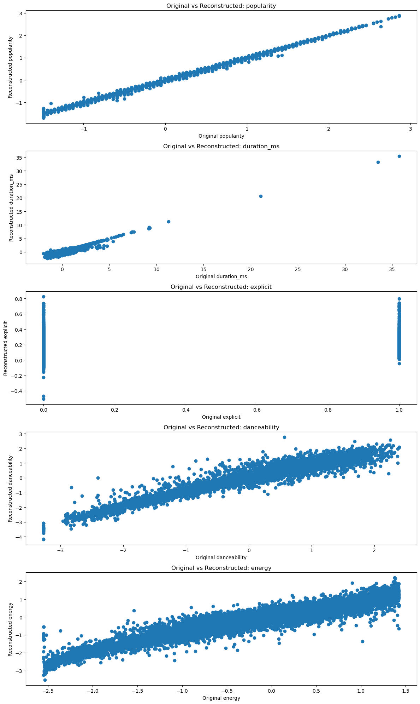
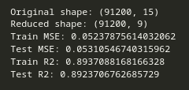
### 4.3

This is on the reduced dimensions of the AutoEncoder

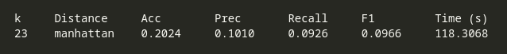

this is on the reduced dimensions of the PCA

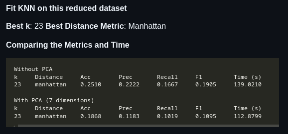

### 4.4 MLP Classifier on spotify data 

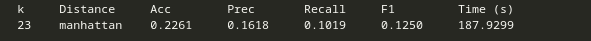

The metrics are as good as the knn results we have acheived in the assignment-1

The accuracy is very simialr but once the mlp is trained the prediction time is very small. The only time going to training the weights and knn increases expoenentially with time which is not the case with MLP assuming same hyperparameters.
