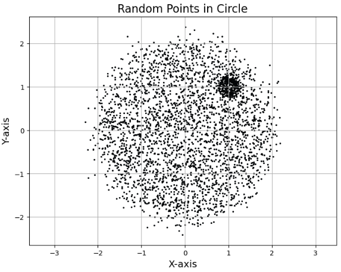

# Assignment-5 Report

## 2. Kernel Density Estimation (KDE)

### 2.1 Task 1: KDE Class Implementation
### 2.2 Task 2: Generate Synthetic Data

### 2.3 Task 3: KDE vs GMM

As the numeber of components increases, the model doesnt fit the data very well unlike when the n was 2 components.
KDE gives a more consistent fit because it only has bandwidth and kernel as hyper params and the classification into categories is soft as it is a density estimate.

## 3. Hidden Markov Model

### 3.1
### 3.2 
Extracted mfcc features with number of features as 13 and variable number of time frames according to the digit and dataset and then concatenated for training.

The voice recognition of my voice gave between 10-40% accuracy as the model also learns the accent and there is a huge difference there
and the model should have lesser components to avoid overfitting the accent, so n = 2,3 gave me 30-40% output accuracy on my voice.